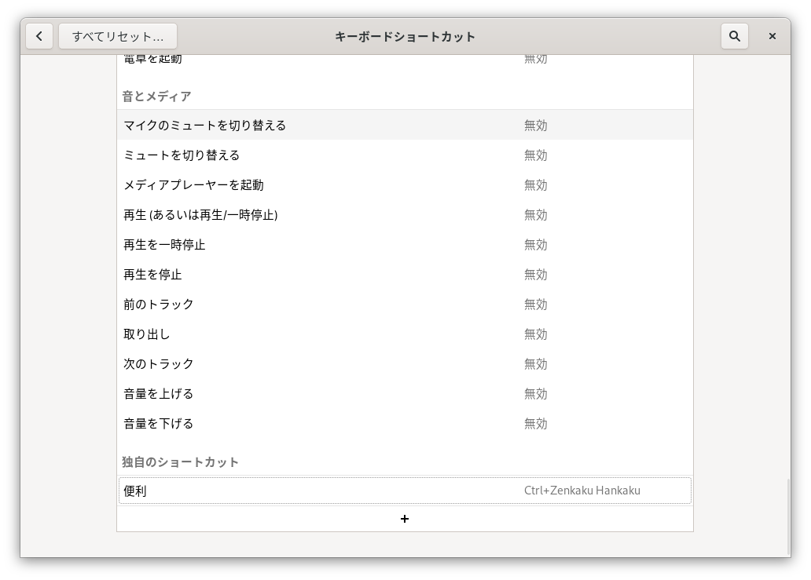
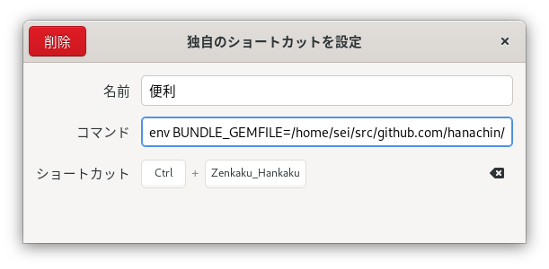

# Tatami

[Divvy](https://mizage.com/divvy/)-like window resizing tool

## Why do I write this?

https://twitter.com/MizageApps/status/463330582290636801

## Demo

<blockquote class="twitter-tweet"><p lang="ja" dir="ltr">Linux向けのDivvyのパクりツールちょっとだけ出来た <a href="https://t.co/ZMu3y20JNm">pic.twitter.com/ZMu3y20JNm</a></p>&mdash; はなちん (@hanachin_) <a href="https://twitter.com/hanachin_/status/1241419684206874624?ref_src=twsrc%5Etfw">March 21, 2020</a></blockquote> <script async src="https://platform.twitter.com/widgets.js" charset="utf-8"></script> 

## How to Use

`bundle install` then set keyboard shortcut from setting panel.




**example**

```
env BUNDLE_GEMFILE=/home/sei/src/github.com/hanachin/tatami/Gemfile RBENV_VERSION=2.7.1 /home/sei/.rbenv/shims/bundle exec ruby /home/sei/src/github.com/hanachin/tatami/tatami.rb
```
